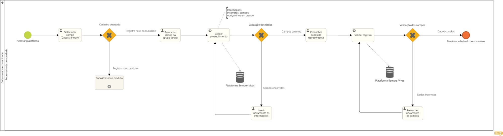

### 3.3.1 Processo 1 – Cadastrar Comunidade

#### Detalhamento das atividades

_O usuário inicia o processo selecionando a opção “Cadastrar Novo” e escolhe o tipo de registro desejado. Em seguida, ele preenche as informações da nova comunidade e dos dados do representante, concluindo o cadastro._

**Preecher Dados do Grupo**

| **Campo**       | **Tipo**         | **Restrições** | **Valor default** |
| ---             | ---              | ---            | ---               |
| Nome Comunidade | Caixa de Texto | Inserção obrigatória de caracteres obrigatórios |                   |
| Características Geográfica | Caixa de Texto | Inserção obrigatória de caracteres albabéticos |                |
| Estado | Caixa de Seleção  | Obrigatória a Escolha de um dos Campos  |           |
| CIdade | Caixa de Seleção  | Obrigatória a Escolha de um dos Campos |           |
| Tipo de Área | Caixa de Seleção  | Obrigatória a Escolha de um dos Campos  |           |
| Descrição | Caixa de Texto | Inserção obrigatória de caracteres albabéticos |                   |

| **Comandos**         |  **Destino**                   | **Tipo** |
| ---                  | ---                            | ---               |
| Cadastrar comunidade | Direcionamento para o cadastro do representante  | Default |
| Cancelar cadastro | Retorno para página inicial sem usuário logado/cadastrado| Cancel |

**Preencher Dados do Representante**

| **Campo**       | **Tipo**         | **Restrições** | **Valor default** |
| ---             | ---              | ---            | ---               |
| Nome Completo | Caixa de Texto | Máximo 100 caracteres |                   |
| Telefone | Caixa de Texto | Inserção obrigatória de caracteres núméricos/Máximo 9 caracteres |                   |
| Papel Social | Caixa de Texto | Máximo 100 caracteres |                   |
| Email | Caixa de Texto | Obrigatória inserção de texto no formato email |                   |

| **Comandos**         |  **Destino**                   | **Tipo**          |
| ---                  | ---                            | ---               |
| Cadastrar Representante | Direcionamento para página inicial com usuário logado/cadastrado | Default |
| Cancelar Cadastro | Direcionamento para página inicial com usuário não logado/cadastrado | Cancel |
