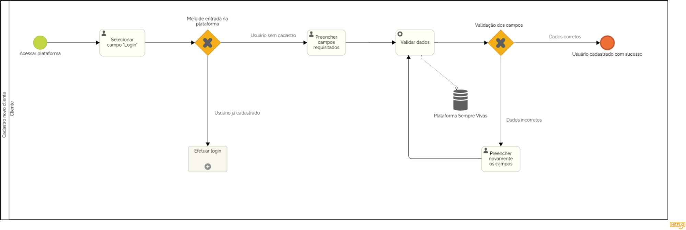

### 3.3.1 Processo 1 – Cadastrar Cliente

#### Detalhamento das atividades

_Ao acessar a plataforma, caso o usuário não possua login, deve selecionar a opção “Novo cadastro”. Após preencher os dados requisitados, o cadastro é concluído._

**Selecionar campo “Login”**

| **Campo**       | **Tipo**         | **Restrições** | **Valor default** |
| ---             | ---              | ---            | ---               |
| Login | Elemento interativo |      |                   |

| **Comandos**         |  **Destino**                   | **Tipo** |
| ---                  | ---                            | ---               |
| Carregar página | Direcionar para a página de login | Default |
| Carregar página | Direcionar para a página de cadastro | Cancel |

**Preencher dados**

| **Campo**       | **Tipo**         | **Restrições** | **Valor default** |
| ---             | ---              | ---            | ---               |
| Nome Completo | Caixa de Texto | Inserção obrigatória de no máximo 100 caracteres |                   |
| Data de nascimento | Caixa de Texto | Inserção obrigatória de dígitos no formato DD/MM/AAAA |                   |
| Estado | Campo de seleção | Obrigatória escolha de um dos campos |                   |
| Cidade | Campo de seleção | Obrigatória escolha de um dos campos |                   |
| Logradouro | Caixa de texto | Inserção obrigatória de no máximo 255 caracteres |                   |
| Bairro | Caixa de texto | Inserção obrigatória de no máximo 100 caracteres |                   |
| Complemento | Caixa de texto | Inserção obrigatória de no máximo 100 caracteres |                   |
| CEP | Caixa de texto | Inserção obrigatória de 8 dígitos |                   |
| Email | Caixa de Texto | Obrigatória inserção de texto no formato email |                   |
| Usuário | Caixa de Texto | Inserção obrigatória de no máximo 2000 caracteres; Mínimo 4 letras; Mínimo umm número ou caractere especial |                   |
| Senha | Caixa de Texto | Mínimo 8 caracteres; Mínimo 2 letras, 4 números e um caracter especial |                   |

| **Comandos**         |  **Destino**                   | **Tipo**          |
| ---                  | ---                            | ---               |
| Cadastrar cliente | Direcionamento para página inicial com usuário logado/cadastrado | Default |

**Inserir novamente as informações**

| **Campo**       | **Tipo**         | **Restrições** | **Valor default** |
| ---             | ---              | ---            | ---               |
