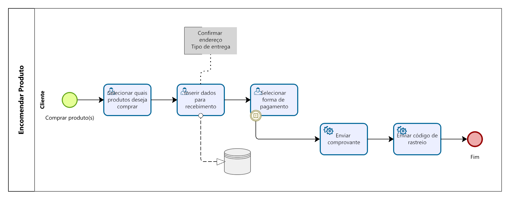

### 3.3.3 Processo 4 – Fazer pedido

#### Detalhamento das atividades

_A opção que permite ao cliente comprar os produtos dentro do site, onde possibilita o preenchimento de seus dados de entrega, e após a validação da compra o processo da venda é finalizado._

**Preecher Dados do Grupo**

| **Campo**       | **Tipo**         | **Restrições** | **Valor default** |
| ---             | ---              | ---            | ---               |
| Item carrinho | Elemento interativo | Obrigatória a escolha de pelo menos um |                   |
| Forma de pagamento | Campo de seleção | Obrigatória a esoclha de um |                |
| Estado | Campo de seleção  | Obrigatória a escolha de um dos campos  |           |
| Cidade | Campo de seleção  | Obrigatória a escolha de um dos campos  |           |
| Endereço | Caixa de texto  | Inserção obrigatória |           |
| Bairro | Caixa de texto  | Inserção obrigatória |           |
| CEP | Caixa de texto  | Inserção obrigatória de numerais |           |
| Tipo de Área | Caixa de Seleção  | Inserção de imagens  |           |

| **Comandos**         |  **Destino**                   | **Tipo** |
| ---                  | ---                            | ---               |
| Escolher produto | Redireciona os produtos escolhidos do carrinho para a área de pagamento  | Default |
| Cadastrar Produto | Seleciona a forma de pagamento dentro das possíveis  | Default |
| Cancelar | Redireciona para a forma de pagamento selecionada e aguarda o recebimento do valor correspondente | Cancel |

