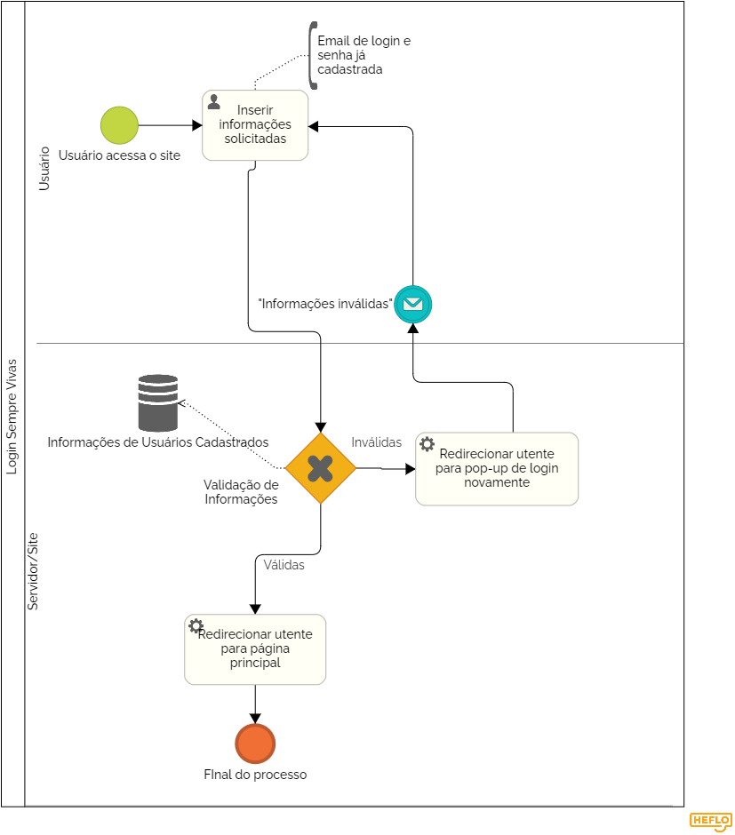

### 3.3.1 Processo 5 – Login

#### Detalhamento das atividades

_Visando acessar funcionalidades específicas do site, o usuário deve realizar o processo de login inserindo email e senha já cadastrados. Caso as informações imputadas não constem no banco de dados, o processo deve ser refeito._

**Inserir informações solicitadas**

| **Campo**       | **Tipo**         | **Restrições** | **Valor default** |
| ---             | ---              | ---            | ---               |
| Login | Caixa de Texto | Inserção obrigatória de texto no formato email |                   |
| Senha | Caixa de Texto | Inserção obrigatória de, no mínimo, 8 caracteres albabéticos e numéricos |                |

| **Comandos**         |  **Destino**                   | **Tipo** |
| ---                  | ---                            | ---               |
| Entrar | Retorno para página inicial com usuário logado | Default |

