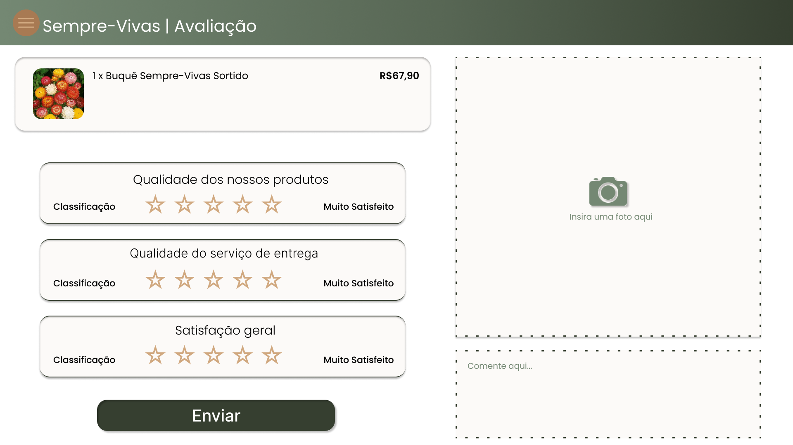

### 3.3.1 Processo 5 – Avaliação

#### Detalhamento das atividades

_Ao receber seu pedido, o usuário terá a opção de classificá-lo por meio de estrelas e de comentar sua opinião quanto ao produto._

**Classificar compras por estrelas**

| **Campo**       | **Tipo**         | **Restrições** | **Valor default** |
| ---             | ---              | ---            | ---               |
| Estrelas | Elemento Interativo | Escolha obrigatória de um ou mais elementos |                   |

| **Comandos**         |  **Destino**                   | **Tipo** |
| ---                  | ---                            | ---               |
| Salvar | Pop-up de confirmação de classificação | Default |
| Salvar | Retorno para página inicial | Cancel |
